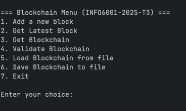

## INFO6001-2025-T3 Assignment 1

### Configure Env

Create & Activate Virtual Env
```python -m venv blockchain```
```source $(pwd)/blockchain/bin/activate```

### Run Application
```python main.py```

